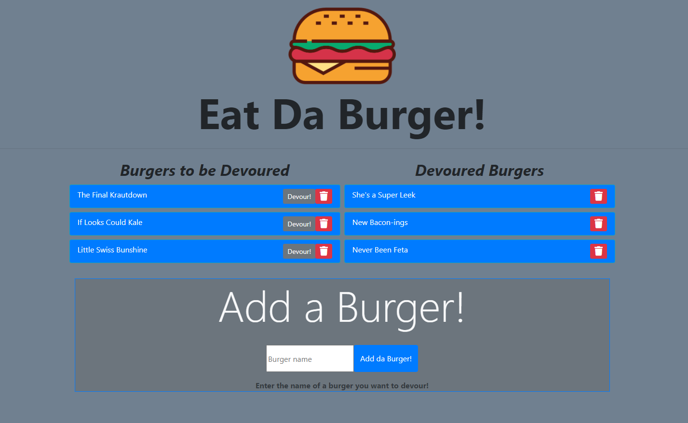

# burger
 
   
  
A burger logger using MySQL, Node, Express, Handlebars and a homemade ORM. Keep track of burgers you want to eat / have eaten!
---

## Table of Contents
  
* [User Story](#User-Story)
* [Usage](#Usage)
* [App in Action](#App-in-Action)
* [Example](#Example)
* [Contents](#Contents)
* [Author](#Author)
* [License](#License)
  
---

## User Story
>As a burger connoisseur  
>I want to be able to track burgers I want to eat and have already eaten  
>So that I can systematically devour every burger  

---

## Usage 
  
This app is deployed to heroku and uses JawsDB and MySql for remote burger database.  

---

## Example

---

## Contents
**Files include:**
* Config -> connection, orm
* Burger Routing Controller
* SQL Schema, SQL Seeds

* JS Burger Model
* Public Static -> HTML, JS, imgs
* Handlebars templates
* Sample Screenshot of App 
* Node.js JSON Packages
* This README file

---

## Author
Abraham Spindel  

---

## License
* [Node.js Project Licensing (MIT)](https://raw.githubusercontent.com/nodejs/node/master/LICENSE)   
* [express Licensing (MIT)](https://github.com/expressjs/express/blob/HEAD/LICENSE)   
* [MySQL npm Licensing (MIT)](https://github.com/mysqljs/mysql/blob/master/License)  
* Node Package Manager (npm) [Artistic License 2.0](https://www.npmjs.com/policies/npm-license)  

